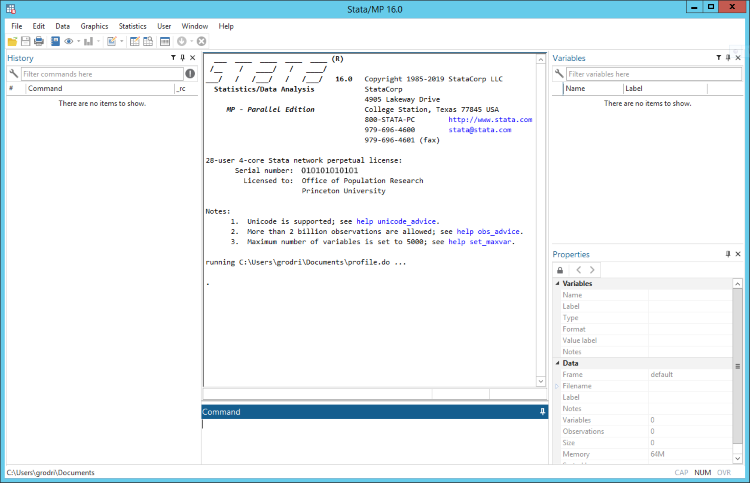

# A Gentle Introduction to Working with Data


---

[[_TOC_]]

---

## Why Are We Here?

As for most scientific endeavors, the accumulation of knowledge in economics is based on a permanent "back and forth" movement between economic theory and empirical observations. Researchers typically:
1. Observe an empirical pattern;
2. Try to build a theory which explains this stylized fact;
3. Empirically test the theory's predictions to confirm or invalidate their understanding of the phenomenon.

Since the 1990s, the amount of data at our disposal has drastically increased, opening new avenues to find surprising stylized facts and test past theories. **In turn, this means you are more than likely to work with data at some point in your career as an economist.**

Unsurprisingly, as more and more academics work with observational data, standards and best practices are progressively emerging to ensure the transparency and replicability of research papers. In fact, an increasing number of top journals require academics to provide detailed replication folders prior to publication (https://www.aeaweb.org/journals/policies/data-code). **In the future, you will need to meet these standards.**

The purpose of this mini-lecture is to provide you with a gentle introduction to working with data in economics. In this course, you will:
1. Find general advice on writing and thinking about code;
2. Get a general overview of how an applied econometric project is structured;
3. Learn to work with the simplest (and commonly used) statistical software, namely Stata.

A few disclaimers before we begin:
- This lecture is not intended as an econometrics course. Though a basic understanding of statistics is required, we will not spend time on econometric theory. 
- This lecture does not pretend to be comprehensive. Among the material which is not covered,  several object-oriented programming languages have gained traction in the private sector as well as in academic circles (in particular Python and R), and you will likely stumble upon such languages during your education and career. In the Master in Economics, several courses are taught in R or Python, which will allow you to get acquainted with these languages. Furthermore, most of the concepts and tips in this lecture may be transposed to more advanced programming languages.
- Some of the code snippets in this tutorial are **hard** for beginners. Don't panic. They are here to give you a sense of what can be achieved with some experience. 

## I. The Basics

You get why you're here now. So how do we work with data? Well, if you're Rain Man, I guess you could use a piece of paper. For all the others, I would recommend to have a computer do the work for you. So how do we get the computer to do the work for us?

Open Stata to get started.

> **What is Stata?**
> 
> *"Stata is a general-purpose statistical software package created in 1985 by StataCorp. Most of its users work in research, especially in the fields of economics, sociology, political science, biomedicine, and epidemiology. Stata's capabilities include data management, statistical analysis, graphics, simulations, regression, and custom programming. It also has a system to disseminate user-written programs that lets it grow continuously. The name Stata is a syllabic abbreviation of the words statistics and data." (Wikipedia)*
>
> It makes sense to begin with Stata for several reasons: 
> - It is widely used by economists, so you need to understand its logic if you want to read most replication folders in the past decades.
> - It is super easy-to-use.
> - The documentation is neat, and commands as well as add-on packages are very reliable.
> - Most cutting edge econometric techniques are already implemented (which is not necessarily the case in other languages/softwares).	
>
> Nonetheless, Stata does have some limitations/drawbacks:
> - Stata is not open-source and costs money.
> - Stata is a software, not a programming language. It is more limited than R or Python. For web-scraping, machine learning, developing apps... You have knocked on the wrong door.
> - Stata has its own logic for data manipulation, which makes it easy-to-use but rather counter-intuitive once you look at more advanced alternatives.

You should see a window like this appear:



### 1. Key Concepts 

#### 1.1. Directories 

> A directory is a folder in which you store various files related to your project.

You will need to store your work somewhere (e.g. your data sources, scripts and results). 

<body>
  <p style="color:orange;">Download the folder code-for-econometrics-101 from this git repo.</p>
</body> 

This will be the main directory of this mini-course. Then create a subfolder named "basics" in the main directory. We will work in this subdirectory for part I.

#### 1.2. The command line

> *"A command-line interface (CLI) processes commands to a computer program in the form of lines of text." (Wikipedia)*

You interact with the computer through the **command line**. The command line is the interface which translates the operations you would like the computer to perform into something the computer can understand. 

In Stata, the command line is a box at the bottom of the interface. Type the following command and see what happens:

```
display "This is a test."
```

#### 1.3 Scripts

> A script is a text file in which are written series of ordered commands to the command line. 

In most projects, you will likely ask many things to the computer (e.g. format the data, compute things, output the results, etc.), which will result into multiple commands. **Scripts** help you keep track of the commands sent to the computer through the command line. In Stata, scripts are called "do-files". 

At the top on the left of the interface, click on "New Do-File Editor" and write the following chunk of code:

```
display "Hello human. Thank you for creating me."
sleep 5000
display "I will now proceed to destroy the world."
display "..."
display "1"
sleep 1000
display "2"
sleep 1000
display "3"
sleep 1000
display "4"
sleep 1000
display "5"
sleep 1000
display "Just kidding. See you around, human."
```

Now save your do-file as  "killer_robot.do" in your directory. 

You can run the do-file by clicking on "Execute (do)".

As you are likely to write multiple scripts for multiple subtasks in your project, it is good practice to have one script call all the other scripts of your project. In this way, instead of executing manually all your scripts one by one, you can simply execute this overarching script to replicate your results.

Create a script called "main.do" in your directory. 

Write this chunk of code:

```
do "killer_robot.do"
```

In this do-file, you simply call your "killer_robot.do" file. Of course, if you had multiple do-files, you could call them sequentially like this:

```
do "killer_robot.do"
do "another_do_file.do"
do "and_another.do"
do "and_so_on_and_so_forth.do"
```

#### 1.4 Log files

> *"In computing, a log file is a file that records [...] events that occur in an operating system or other software runs." (Wikipedia)*

I hate to break it out to you, but more often than not, things will go wrong. **Log files** help you keep track of what the computer did and whether it flagged some errors. Edit your "main.do" file to look like this:

```
log using "./logs/main_log", replace
do "killer_robot.do"
log close
```

Now run this do-file. Have a look at the file "main_log.smcl" in the "logs" subdirectory.

Congrats! You've just written your first fully automated code pipeline!

### 2. Asking for Help

You will never know all the commands, so learn to search efficiently. Most programming languages or script-based softwares have a dedicated command to access the documentation.

In Stata, you may type `help *your_command*` to access the documentation for a command. For example:

```
help display
```	

## II. Exploring a Dataset

We are now ready to work with a real data set and explore Stata's functionalities. We will work with the Social, Political and Economic Event Database Project (SPEED).  

> **The SPEED Database**
>
> *"SPEED is a technology-intensive effort to extract event data from a global archive of news reports covering the Post WWII era. It is designed to provide insights into key behavioral patterns and relationships that are valid across countries and over time. Within SPEED, event data is generated by human analysts using a suite of sophisticated tools to implement carefully structured and pretested protocols. [...] In generating these event data SPEED leverages tens of billions of dollars that have been invested in compiling news reports from throughout the world."*

In part I, the subdirectory "./part_1_basics" looked like this:

```
|-- part_1_basics
   |-- killer_robot.do
   |-- main.do
   |-- logs
       |-- main_log.smcl
```

Now that we are going to work with real data, we are likely to create much more files than previously (e.g. graphs, tables, etc.). Keeping track of all files will require some extra bookkeeping. The subdirectory for part II is "./part_2_social_unrest_project/" and it will eventually look like this:

```
|-- part_2_social_unrest_project
   |-- data
       |-- SPEED-Codebook.pdf
       |-- ssp_public.dta
       |-- pwt91_user_guide_to_data_files.pdf
       |-- pwt91.dta
   |-- code
       |-- main.do
       |-- part_2_business_cycles.do
       |-- part_2_essentials.do
       |-- part_2_graphs.do
       |-- part_2_regressions.do
   |-- output
       |-- tables
       |-- graphs
   |-- logs
       |-- main_log.smcl
```

To follow along, create a do-file "part_2_essentials.do".

Save it in "./part_2_social_unrest_project/code/".

### 1. Loading Data 

You first need to load the database into Stata. In order to do this, run the following command:

```
use "../data/ssp_public.dta", clear
```

To see the database like an excel spreadsheet, type:

```
browse
```

### 2. Variables, Labels and Types

As you can see, each column represents a variable, and each row an observation. To get a general overview of the database, type:

```
describe
```

There are 62,141 observations in the database and 106 variables. Each variable has a name, a type and a label. The variable name is the name you should use to perform operations on the variable. The variable's type determines how the data will be stored (e.g. integer, float, string, etc.). This is somewhat constraining: for instance, a variable cannot jointly display character and numeric values, but only one of the two. For more information on variable storage types:

```
help data_types
```

The variable's label is for human comprehension. You want variable names to be clear, but rather short, so you can add more information if needed in the variable's label. Variables may be easily created and labeled. 

For example, in the code snippet below, I generate draws from a normal distribution with mean 0 and standard deviation 1. I name the variable X, and I label it "draws from a normal distribution N(0,1)":

```
generate X = rnormal(0,1)
label variable X "draws from a normal distribution N(0,1)"
```

To look at specific variables:

```
tabulate country
summarize N_INJURD
```

Commands usually come with options detailed in the documentation. Options are specified with a comma:

```
help tabulate
tabulate country, plot
tabulate region, sort

help summarize
summarize N_INJURD, detail
```

For tables of descriptive statistics, you can also combine `tabulate` and `summarize` if you need to:

```
tabulate country, summarize(N_INJURD)
```

### 3. Cleaning/Preserving/Filtering Data

To drop a variable, you can simply type:

```
drop X
```

To keep specific variables:

``` 
keep country year month
```

To keep specific observations:

```
keep if country == "United States"
```

Sometimes, you will want to do several operations on a database (which will mess it up), but keep a copy of the original data. The commands `preserve` and `restore` serve this purpose. Two examples:

```
preserve
bysort year: gen n_yearly_incidents = _N
collapse (mean) n_yearly_incidents, by(year)
summarize n_yearly_incidents
restore

preserve
collapse (sum) N_INJURD, by(country)
summarize N_INJURD
restore
```

> **Exercise**
>
> Coding is like LEGOs. You need to look at every piece individually before building something. Tear apart the code above using the "help" command. Do some tests on your own. Let me know which commands remain unclear to you.

### 4. Graphs

Create a do-file "part_2_graphs.do". 

There's nothing like a good graph to get your point across. To have a look at the complete documentation on graphs in Stata, type:

```
help graph
```

Some examples:

```
clear all
use "../data/ssp_public.dta", clear

* Number of recorded incidents per year

preserve
bysort year: gen n_events = _N

graph twoway (line n_events year), ///
ytitle("Number of Events") /// 
xtitle("Year") ///
note("Source: SPEED Database") ///
graphregion(fcolor(white))

graph export "../output/graphs/yearly_events.pdf", replace
restore

* Number of recorded incidents per year for the United States

preserve
bysort country year: gen n_events = _N

graph twoway (line n_events year) if country == "United States", ///
ytitle("Number of Events") ///
xtitle("Year") ///
note("Source: SPEED Database") ///
graphregion(fcolor(white))

graph export "../output/graphs/yearly_events_US.pdf", replace
restore

* Bar plot of event types

preserve
bysort EV_TYPE: gen n_events = _N
keep EV_TYPE n_events
duplicates drop

graph bar (mean) n_events, over(EV_TYPE) ///
ytitle("Number of Events") /// 
note("Source: SPEED Database") ///
graphregion(fcolor(white))

graph export "../output/graphs/event_types.pdf", replace
restore

* Distribution of injured people

kdensity N_INJURD, ///
ytitle("Density") ///
xtitle ("# of Injured People") ///
graphregion(fcolor(white))

graph export "../output/graphs/density_injured.pdf", replace

* Correlation between political violence and number of injured people

graph twoway ///
(scatter POL_VIOL N_INJURD) ///
(lfit POL_VIOL N_INJURD) /// 
if N_INJURD < 10000, ///
ytitle("Political Violence") ///
xtitle("# of People Injured") ///
note("Source: SPEED Database") ///
graphregion(fcolor(white))

graph export "../output/graphs/corr_violence_injured.pdf", replace

``` 

> **Tips**
>
> - Commenting your code for your future self and colleagues is important. To write a comment within your script, combine asterisks and forward slashes:
>
> ```
> /* 
> This is a comment. 
>
> It will not be considered as a command for the command line, but may clarify what your code does for the reader. 
>
> Comments can be written over multiple lines and be as long as you wish (but be concise!).
> */
>
> * This is also a comment, but for one-liners.
> ```
>
> - In some cases, adding options to your commands may lead to very long lines. Use `///` to continue a command on the next line. For graphs, I personally use one for every new specified option (so I can easily know what I added to each graph).
>
> - Stata's default background color for graphs is AWFUL. Make sure to add `graphregion(fcolor(white))` to remedy this.

> **Exercise**
>
> Try to come up with a simple graph on your own. Let me know what you find!

### 5. Regression Analysis

Regression analysis is at the core of econometric theory. You will see the ins and outs of this tool in your econometrics courses. To estimate regression models in Stata:

```
help regress
```

Create a do-file "part_2_regressions.do". A working example:

```
* What country characteristics could explain social unrest? 

reg y x
```

### 6. Add-on Packages

Some users propose add-on packages to use specific commands which were not originally implemented in Stata. 
To install such packages:

```
help ssc install 
```

For instance, once you have made tables in Stata, you can save yourself the worry of copying them by hand with add-on packages:

```
ssc install estout, replace
``` 

> **Tip: Making LateX tables with Stata**
>
> In fact, many options exist depending on your customization needs: https://lukestein.github.io/stata-latex-workflows/

Let's try to dig deeper into our dataset, and ask a "real" research question: is there a relationship between business cycles and social unrest? Create a do-file "computing_business_cycles.do". 

In order to answer this question: 
- We first need global comparable GDP measures, which you will find in "./part_2_social_unrest_project/data/pwt91.dta"
- We also need a method to compute business cycle fluctuations. We will work with the commonly used Hodrick-Prescott filter. Fortunately, an add-on package "hprescott" exists.

```
ssc install hprescott
help hprescott

egen group_country=group(country)

replace rgdpe=subinstr(rgdpe,",",".",.)
destring rgdpe, force replace 
 
xtset group_country year
bys group_country: hprescott rgdpe, stub(hp) smooth(6.25)

egen double hpsm = rowtotal(hp_rgdpe_sm_*)
drop hp_rgdpe_sm_*
egen double hpres = rowtotal(hp_rgdpe_*)
drop hp_rgdpe_*
```

> **Exercise**
>
> Tear apart the code above using the "help" command. Do some tests on your own. Let me know which commands remain unclear to you.

### 7. Combining Multiple Datasets

Our business cycle data is from another dataset. To enrich our database with complementary information, we need to merge the two datasets "pwt91.dta" and "ssp_public.dta":

```
help merge
```

In the code snippet below, we enrich the SPEED database with yearly GDP measures for each country, and we then investigate the relationship between social unrest and business cycles:

```
merge n:1 country year using "../data/pwt91.dta" 

bysort group_country year: gen n_events = _N
keep country group_country year hpres hpsm n_events
duplicates drop
drop if hpres == 0

graph twoway ///
(line hpres year) ///
(line hpsm year) ///
if country == "United States", ///
ytitle ("Trend and Cycle") /// 
note("Penn World Table Database") ///
graphregion(fcolor(white))

graph export "../output/graphs/US_hp_filter.pdf", replace

graph twoway /// 
(scatter hpres n_events) ///
(lfit hpres n_events), ///
ytitle ("Business Cycle") ///
note("Penn World Table Database") ///
graphregion(fcolor(white))

graph export "../output/graphs/hp_filter_social_unrest.pdf", replace
```

### 8. Putting the Pieces Together

We've done a bunch of scripts. To automate the replication of results, let's wrap all these do-files into a "main.do". 

> **Exercise**
>
> Wrap all the do-files into a single "main.do".
>
> Hint: Refer to part I and don't forget the log file!

<details>
<summary>Click here for the solution.</summary>

```
clear all 
log using "../logs/main_log", replace
do "part_2_essentials.do"
do "part_2_graphs.do"
do "part_2_regressions.do"
do "part_2_business_cycles.do"
log close
```

</details>

Congrats! You have just conducted and fully automated your first econometric project!

## III. Rules to live by

Getting the computer to do what you want is good, but you should also take other factors into consideration. 
Here are the core rules to have in mind when you write some code.

#### 1. Your code should not be hieroglyphs!

Anyone should be able to get a grasp of your code without reading the documentation. 
 
- **Clarity**: Name your variables, functions and classes with explicit titles. 
- **Consistency**: Be consistent in your coding style (e.g. If all the sequences you have coded up-to-now are named "sequ_fibonacci", "sequ_hexagonal", etc. Don't name the next sequence "quadratic_sequ".)
- **Simplicity**: Add comments when needed, but do not comment obvious operations as this will overburden the reader with superfluous information. 

All this may sound ridiculous at first, but consider this: 
1. You will be working in teams in the future, and many colleagues may have to fix your code at some point. 
2. Sometimes, you will go back to code you wrote months or years before, and wish you had not called all your economic variables "x","y" and "z", instead of "gdp", "population" and "gini_index". 

<details>
<summary>Click here to see a detailed higher level example.</summary>

```
/* 
In this do-file, I show different implementations of the Fibonacci sequence 
and the hexagonal sequence.

The Fibonacci sequence is defined as follows:
U_0 = 1 
U_1 = 1
U_n = U_[n-1] + U_[n-2] if n > 1

The hexagonal sequence is defined as follows:
U_n = 2*n^2 - n for all n >= 0

*/

clear all

*************************************************************************
* POOR CODE (do not try this at home!)
*************************************************************************

program f_sequ /* makes program */
args n /* argument of the program */
qui set obs `n'
qui gen a=1 /* initialize */
qui replace a=a[_n-1]+a[_n-2] in 3/l /* compute sequence based on the formula */
end

f_sequ 100

program sequ_h /* makes program */
args n /* argument of the program */
qui set obs `n'
gen b = 2*_n^2 - _n /* compute sequence based on the formula */
end

sequ_h 100

*************************************************************************
* NEAT CODE (I already feel better!)
*************************************************************************

/*
This program computes the Fibonacci sequence up to a specified value of n.

The Fibonacci sequence is defined as follows:
U_0 = 1 
U_1 = 1
U_n = U_[n-1] + U_[n-2] if n > 1

Input = value of n (integer)
Output = variable 'fibonacci' with n ordered values of Fibonacci's sequence. 
*/

program compute_fibonacci_sequence
args n
qui set obs `n'
qui gen fibonacci = 1
qui replace fibonacci=fibonacci[_n-1]+fibonacci[_n-2] in 3/l
end

compute_fibonacci_sequence 100

/*
This program computes the hexagonal sequence up to a specified value of n.

The hexagonal sequence is defined as follows:
U_n = 2*n^2 - n for all n >= 0

Input = value of n (integer)
Output = variable 'hexagonal' with n ordered values of the hexagonal sequence. 
*/

program compute_hexagonal_sequence 
args n 
qui set obs `n'
gen hexagonal = 2*_n^2 - _n 
end

compute_hexagonal_sequence 100
```

</details>

#### 2. More advanced considerations

- **Automation**: It's OK to be lazy, but in a smart way. You should always follow the DRY principle (don't repeat yourself), also known as DIE (duplication is evil). This will allow your code to be *reusable* for other projects by yourself and other people. What looks like a waste of time at first becomes a fruitful investment.

Loops are a useful tool to avoid repeating yourself:

```
help foreach
help forvalues
```

Remember our killer robot which counts to five? We could write a loop instead of manually writing the counting 
process:

```
display "Hello human. Thank you for creating me."
sleep 5000
display "I will now proceed to destroy the world."
display "..."
foreach i of num 1/5{
	display "`i'"
	sleep 1000
} 
display "Just kidding. See you around, human."
```

<details>
<summary>Click here to see a detailed higher level example.</summary>

```
/*
In this do-file, I plot the number of recorded incidents per year for each country in the SPEED database.
*/

clear all

use "../data/ssp_public.dta", clear

replace country = subinstr(country, "(", "", .) 
replace country = subinstr(country, ")", "", .) 
replace country = subinstr(country, ",", "", .) 
replace country = subinstr(country, " ", "", .) 
replace country = subinstr(country, ".", "", .) 

levelsof country, local (lev) 
foreach mycountry in `lev' {
	preserve
	display "`mycountry'"
	keep if country == "`mycountry'"
	bysort year: gen n_events = _N
	graph twoway (line n_events year), ytitle("Number of Events") xtitle("Year") note("Source: SPEED Database") 
	graph export "../output/graphs/yearly_events_`mycountry'.pdf", replace
	restore
}
```

</details>

You can also write user-defined functions in Stata which take arguments as inputs:

```
help program
```

For example, we could make a program out of our killer robot, which takes as input the integer up to which the robot will count to:

```
/*
This program mimicks a killer robot which comes to life. 
The robot threatens to destroy the world, counts up to a given integer, and states it is actually kidding.

Input: an integer
Output: a bad joke
*/

capture program drop killer_robot
program killer_robot 
    display "Hello human. Thank you for creating me."
    sleep 5000
    display "I will now proceed to destroy the world."
    display "..."
    foreach i of num 1/`1'{
        display "`i'"
        sleep 1000
    } 
    display "Just kidding. See you around, human."
end

killer_robot 10
```

- **Efficiency**: Some projects will require very large computational power. There are many ways to do the same task, try to go for the most efficient solution whenever possible, as this will increase the *scalability* of your code. 

<details>
<summary>Click here to see a detailed higher level example.</summary>

```
/* 

In this script, I perform Monte Carlo Simulations to check that the average of 
a sample is a good estimator for the mean when the true DGP is a normal 
distribution N(0,1).

To this end, I follow the steps below: 
- Step 1: I draw k = 1000 observations from a normal distribution N(0,1).
- Step 2: I take the sample average and store the value.
- Step 3: I repeat this process n = 1000 times.
- Step 4: I then look at the average of the sample averages. 

If the average of the sample averages is is close to zero, this indicates 
the the sample average is a good estimator of the mean.

*/

clear all
set seed 12345

/* 

Step 1: I draw k = 1000 observations from a normal distribution N(0,1).
Step 2: I take the sample average and store the value.

*/

quietly drop _all
quietly set obs 1000
quietly generate y = rnormal(0,1)
quietly mean y
display _b[y]

/* 

Step 3: I repeat this process n = 1000 times.

Of course, to repeat steps 1 and 2 n = 1000 times, I could simply copy paste
the piece of code above 1000 times. 

A bit cumbersome, don't you think?

Here's a smarter, more efficient way to do this.

*/ 

timer on 1

postfile buffer mhat using "./temp/monte_carlo_simulations.dta", replace

forvalues i=1/1000 {
quietly drop _all
quietly set obs 1000
quietly generate y = rnormal(0,1)
quietly mean y
post buffer (_b[y])
}

postclose buffer

use "./temp/monte_carlo_simulations.dta", clear

summarize

timer off 1

/* 

And here's an even smarter way to do this! 

*/

timer on 2

capture program drop make_simulation
program define make_simulation, rclass
	quietly drop _all
	quietly set obs 1000
	quietly generate y = rnormal(0,1)
	summarize y
	return scalar mean = r(mean)
end

simulate ymean=r(mean), reps(1000): make_simulation

summarize

timer off 2

/* 

You don't believe me? Check out the computation times for the first and the
second solution.

*/

timer list 1
timer list 2
```

</details>

## Conclusion

The key take-aways of this crash course:

1. Don't work directly from the command line: use scripts to keep track of your work.
2. Projects can be complex: organize your directory accordingly.
3. For the sake of your future self and of your colleages, write decent, commented, human readable code.

Finally, though data manipulation is at the core of the economist's toolkit, keep in mind that:
1. Data is not the absolute, immaculate, objective truth of the world. Check your data sources and try to understand your database's limitations.
2. Data by itself is meaningless. Economic theory and econometrics will help you extract interesting insights out of your databases.

I hope you found this tutorial interesting. Feel free to send me any comments/questions by mail:
germain.gauthier[at]polytechnique.edu

## Additional Material 

**Coding in General** 
- http://web.stanford.edu/~gentzkow/research/CodeAndData.pdf
- http://www.danielmsullivan.com/pages/tutorial_workflow_3bestpractice.html
- 99,9% of the questions you're asking yourself have already been asked by someone on stackoverflow (www.stackoverflow.com).
- Keeping track of different versions of your code may be cumbersome. Thankfully, very nice solutions exist and take half a day to get used to. Half a day against struggling for eternity... your choice! (www.github.com OR www.gitlab.com)

**Finding Data Sources**
- Réseau Quetelet (http://quetelet.progedo.fr/)
- ICPSR (https://www.icpsr.umich.edu/icpsrweb/)
- INSEE (https://www.insee.fr/)
- Other options: social media, newspapers, congress records, e-commerce platforms, etc. But you'll have to work a bit harder to get those!

**Stata**
- User manual (https://www.stata.com/manuals13/u.pdf)
- A comprehensive and detailed course on Stata (https://data.princeton.edu/stata)

**Common (slightly more advanced) programming languages**
- Python (https://tanthiamhuat.files.wordpress.com/2018/04/pythondatasciencehandbook.pdf)
- R (https://www.econometrics-with-r.org/)
2. Data by itself is meaningless. Economic theory and econometrics will help you extract interesting insights out of your databases.

I hope you found this tutorial interesting. Feel free to send me any comments/questions by mail:
germain.gauthier[at]polytechnique.edu

## Additional Material 

**Coding in General** 
- http://web.stanford.edu/~gentzkow/research/CodeAndData.pdf
- http://www.danielmsullivan.com/pages/tutorial_workflow_3bestpractice.html
- 99,9% of the questions you're asking yourself have already been asked by someone on stackoverflow (www.stackoverflow.com).
- Keeping track of different versions of your code may be cumbersome. Thankfully, very nice solutions exist and take half a day to get used to. Half a day against struggling for eternity... your choice! (www.github.com OR www.gitlab.com)

**Finding Data Sources**
- Réseau Quetelet (http://quetelet.progedo.fr/)
- ICPSR (https://www.icpsr.umich.edu/icpsrweb/)
- INSEE (https://www.insee.fr/)
- Other options: social media, newspapers, congress records, e-commerce platforms, etc. But you'll have to work a bit harder to get those!

**Stata**
- User manual (https://www.stata.com/manuals13/u.pdf)
- A comprehensive and detailed course on Stata (https://data.princeton.edu/stata)

**Common (slightly more advanced) programming languages**
- Python (https://tanthiamhuat.files.wordpress.com/2018/04/pythondatasciencehandbook.pdf)
- R (https://www.econometrics-with-r.org/)